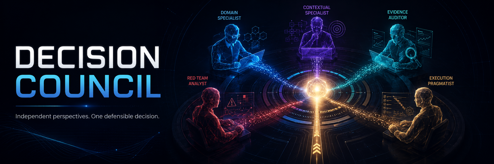

# Decision Council



A structured multi-persona council skill for AI coding agents that produces one defensible collective recommendation on consequential decisions.

Instead of asking an AI for a single opinion, Decision Council convenes independent expert personas, runs adversarial peer review, forces revision, and synthesizes the result into one clear recommendation — with preserved dissent.

**Works with:** Claude Code, Codex CLI, Gemini CLI, GitHub Copilot, and any agent supporting the [Agent Skills open standard](https://agentskills.io).

---

## Install

```bash
npx skills add LeonardSEO/decision-council
```

Or install globally:

```bash
npx skills add LeonardSEO/decision-council -g
```

For a specific agent:

```bash
npx skills add LeonardSEO/decision-council -a claude-code
npx skills add LeonardSEO/decision-council -a codex
npx skills add LeonardSEO/decision-council -a cursor
```

## Update

```bash
npx skills update decision-council
```

---

## Usage

Once installed, the skill activates automatically when you ask for a decision, recommendation, verdict, or second opinion.

**Examples that trigger the council:**

```
Should we choose Supabase or PlanetScale for our new SaaS?
We have two candidates for the CTO role. Help me decide.
Our team is split on microservices vs. monolith. What should we do?
Review this architecture proposal and tell me if it's sound.
We received a €2M acquisition offer and a €1.5M Series A. Which should we take?
```

**Examples that do NOT trigger the council** (direct answer instead):

```
What is the difference between REST and GraphQL?
How do I install Node.js?
Summarize this document.
```

---

## How it works

Decision Council runs a structured 8-step protocol:

```
1. Decision Brief    → frames the exact decision, criteria, and weights
2. Evidence Packet   → gathers verified facts, inferences, assumptions, unknowns
3. Council           → independent memos from 5 expert personas
4. Blind Review      → anonymized peer critique with criterion scoring
5. Revision          → each advisor updates position based on evidence (not social pressure)
6. Aggregation       → vote count, weighted scores, consensus classification
7. Integrity Check   → verify no bias from order, length, or confidence tone
8. Output            → one recommendation, trade-off, minority view, first action
```

The depth scales automatically:

| Depth | When used | Personas |
|---|---|---|
| **Light** | Low-stakes, reversible | 3 advisors → direct synthesis |
| **Standard** | Normal decisions | 5 advisors → review → revision |
| **High scrutiny** | Costly, hard to reverse, legal, medical, financial, strategic | Research + 5 advisors → review → revision → counterfactual |

---

## Personas

Two personas are assigned dynamically based on the decision domain. Three are always present.

| Persona | Type | Role |
|---|---|---|
| **Primary Domain Specialist** | Dynamic | Subject-matter expertise relevant to the decision |
| **Contextual Specialist** | Dynamic | Most critical uncovered dimension (customer, security, compliance, etc.) |
| **Evidence Auditor** | Fixed | Tests factual support, logic, uncertainty, and unsupported claims |
| **Red Team Analyst** | Fixed | Searches for failure modes, hidden costs, and disconfirming evidence |
| **Execution Pragmatist** | Fixed | Evaluates feasibility, resources, and reversibility |

Non-voting facilitators:
- **Problem Framer** — defines the right decision before the council meets
- **Chair** — aggregates results, does not vote

---

## Output format

Default output (no file created unless requested):

```
## Decision
[One clear recommendation]
Confidence: X%
Consensus: strong / qualified / none

## Decisive Reasons
1. [Reason tied to evidence or criterion score]
2. [Reason]
3. [Reason]

## Weighted Result
| Alternative | Weighted Score | Revised Votes | Median Confidence |
|---|---:|---:|---:|
| Option A | 74 | 4/5 | 78% |

## Main Trade-Off
[What you give up by choosing this option]

## Strongest Case for the Runner-Up
[Best argument for the second-place option]

## Minority Objection
[Strongest unresolved objection]

## Critical Assumption
[The assumption the recommendation depends on]

## What Would Change the Decision
[Single plausible fact or weight change that flips the result]

## First Action
[One concrete and reversible next step]
```

Full council transcript available on request.

---

## Design principles

- **One recommendation.** The council never ends with a menu of equally weighted options.
- **No manufactured consensus.** Disagreement is labeled accurately.
- **Preserved dissent.** The strongest minority objection always appears in the output.
- **Evidence over confidence.** Positions backed by weak evidence get lower scores, regardless of how confidently stated.
- **Protocol-driven, not persona-driven.** The outcome depends on the decision criteria and evidence, not on which persona argued most persuasively.

---

## File structure

```
decision-council/
├── SKILL.md                           ← main protocol (loaded by agent)
├── README.md                          ← this file
├── references/
│   ├── personas.md                    ← full persona instructions
│   ├── scoring-rubric.md              ← criteria design, scoring, consensus rules
├── assets/
│   └── final-answer-template.md      ← output template
└── evals/
    └── trigger-queries.json           ← test cases
```

---

## License

MIT
